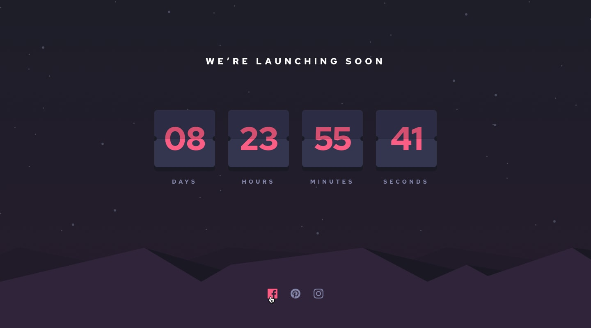

# Frontend Mentor - Launch countdown timer solution

This is a solution to the [Launch countdown timer challenge on Frontend Mentor](https://www.frontendmentor.io/challenges/launch-countdown-timer-N0XkGfyz-). Frontend Mentor challenges help you improve your coding skills by building realistic projects. 

## Table of contents

- [Overview](#overview)
  - [The challenge](#the-challenge)
  - [Screenshot](#screenshot)
  - [Links](#links)
- [My process](#my-process)
  - [Built with](#built-with)
  - [What I learned](#what-i-learned)
  - [Continued development](#continued-development)
  - [Useful resources](#useful-resources)
- [Author](#author)
- [Acknowledgments](#acknowledgments)


## Overview

### The challenge

Users should be able to:

- See hover states for all interactive elements on the page
- See a live countdown timer that ticks down every second (start the count at 14 days)
- **Bonus**: When a number changes, make the card flip from the middle

### Screenshot





### Links

- Solution URL: [Add solution URL here](https://your-solution-url.com)
- Live Site URL: [Add live site URL here](https://your-live-site-url.com)

## My process

### Built with

- Semantic HTML5 markup
- CSS custom properties
- Flexbox
- CSS Grid

### What I learned

i learned how to start count donw from a specific days and how to deals with Hours, days, minutes and seconds 
and also learn how to make a flip card animation 
To see how you can add code snippets, see below:

```html
<h1>Some HTML code I'm proud of</h1>
```
```css
.proud-of-this-css {
  color: papayawhip;
}
```
```js
function flipAllCards(time) {
    let days = Math.floor(time / (1000 * 60 * 60 * 24));
    let hours = Math.floor(time / (1000 * 60 * 60) % 24);
    let minutes = Math.floor(time / (1000 * 60) % 60);
    let seconds = Math.floor(time / (1000) % 60);}
```


### Continued development

-want to  focus more on count donw function to master it 
-learn more animation styles and how to make it 


### Useful resources

- [Example resource 1](https://www.youtube.com/watch?v=x00P_1meF6c) - This helped me to make the flip card animation 
- [Example resource 2](https://www.youtube.com/watch?v=eFsiOTJrrE8&list=PLDoPjvoNmBAycCXz5d9WvqlmykUIys5e8&index=16) - This is helped me to understand the logic of countdonw function 


## Author

- Frontend Mentor - [@abanoubamgadnsary](https://www.frontendmentor.io/profile/abanoubamgadnsary)


## Acknowledgments

i will alawys send my gratitude to Eng.Osama El zero for his great effort in taught us the programming languages  
